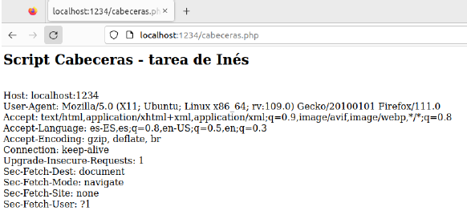
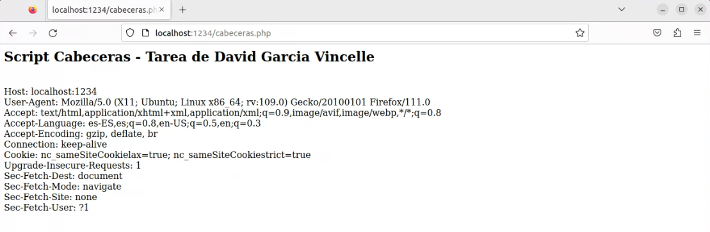
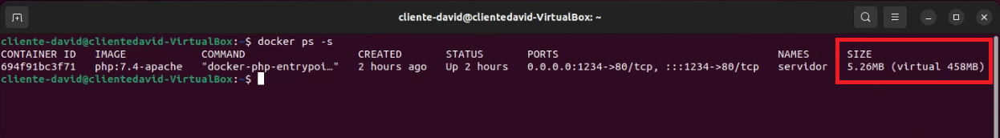
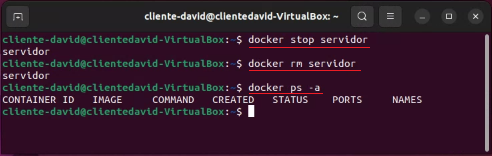
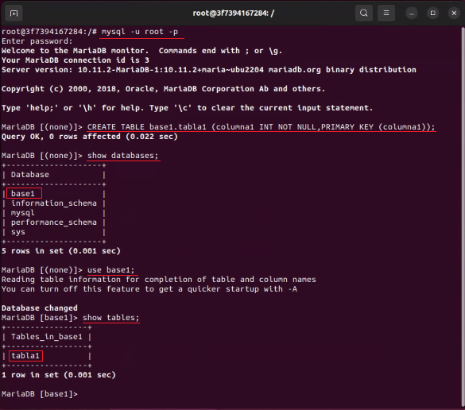
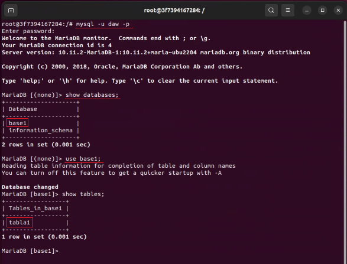
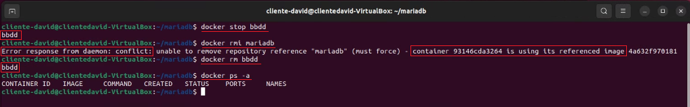

---

title: Tarea Evaluable 2 - Primer Cuatrimestre
author: David García Vincelle
creator: Typora inc.
subject: Despliegue de Aplicaciones Web
footer: David García Vincelle - Actividad Evaluable 3 EV2 Ejercicio 1


---


<h1 style='padding-left: 5%;padding-right: 5%;letter-spacing: 5px;font-size: 200%;'>  
TAREA EVALUABLE 3<br>SEGUNDO CUATRIMESTRE
<h4 style='text-align: right;padding-right: 7.2%'> DESPLIEGUE DE APLICACIONES WEB</h4>
</h1>


<h3 style='text-align: right;padding-right: 7.2%'> David García Vincelle</h3> 

<div style="page-break-after: always;"></div>

# Solución Ejercicio 1
## 1.1 Servidor Web

#### 1.1.1 Arranca un contenedor que ejecute una instancia de la imagen `php:7.4-apache`, que se llame `servidor` y que sea accesible desde un navegador en el puerto 1234.

Partimo de un entorno donde ya tenemos instalado docker. Realizamos lo solicitado con un solo comando:

```dockerfile
docker run -d --name servidor -p 1234:80 php:7.4-apache
```


#### 1.1.2 Coloca en el directorio raíz del servicio web ( /var/www/html ) de dicho contenedor un sitio web

> En la página index.html debe aparecer el texto: Tarea de Docker de **Nombre Apellido**

- Vamos a descargar una plantilla que a continuación personalizaremos

  ```bash
  wget https://www.free-css.com/assets/files/free-css-templates/download/page289/4uhost.zip
  ```

- La descomprimimos en el directorio de usuario y personalizamos el fichero `index.html` para que aparezca el texto: **Tarea de Docker de David Garcia Vincelle**

   > En mi caso me encuentro en: `/home/cliente-david`
   >
   > Para personalizar el fichero `index.html`, utilizo el editor de textos de ubuntu
   >
   > ```
   > gedit 4uhost-html/index.html
   > ```


- Una vez personalizado el fichero `index.html`, copiamos la carpeta `4uhost-html/`, recursivamente, en la ubicación `/var/www/html/` de nuestro `servidor`

  ```dockerfile
  docker cp 4uhost-html/.  servidor:/var/www/html/.
  ```


- Ahora **comprobamos que el sitio web está operativo** y que el `index.html` de la plantilla que descargamos se encuentra  modificado con el texto que queríamos

  > Abrimos el navegador web Firefox y escribimos la dirección de nuestro servicio web:`localhost:1234`

  ##### 


#### 1.1.3 Coloca en ese mismo directorio raíz un archivo llamado cabeceras.php que muestre todas las cabeceras de petición HTTP de la llamada actual. Ver la salida del script en el navegador. Deberás ver algo similar a esto:



- Creamos un fichero llamado `cabeceras.php` e insertamos el siguiente código php:

  ```php+HTML
  <h2>Script Cabeceras - Tarea de David Garcia Vincelle</h2><br>
  <?php
  foreach (getallheaders() as $nombre => $valor) {
    echo "$nombre: $valor\n";?><br><?php
  }
  ```

  > Para crear el fichero `index.html` e implementar el código, utilizo el editor de textos de ubuntu
  > ```bash
  > gedit cabeceras.php


- Una vez creado, copiamos el fichero `cabeceras.php`al contenedor, en el directorio raiz del servicio web

  ```
  docker cp cabeceras.php servidor:/var/www/html/.
  ```

- **Vemos la salida del script en el navegador**

  

- **Visualizamos el tamaño del contenedor**, ahora que tenemos añadido nuestro sitio y el script php

  ```
  docker ps -s
  ```
  
  


#### 1.1.4 Borramos el contenedor

- Paramos el contenedor, despues lo borramos y comprobamos que ya no hay ninguno activo

  ```
  docker stop servidor
  docker rm servidor
  docker ps
  ```
  


## 1.2 Servidor de base de datos

*Visita la página de la imagen oficial de `mariadb` en [Docker Hub](https://hub.docker.com/search?q=mariadb)*


#### 1.2.1 Crear un contenedor con la siguientes características

>- Que se llame `bbdd` y que ejecute una instancia de la imagen **mariadb**
>- Establece las variables de entorno necesarias para que:
>  - La contraseña de root sea `root`
>  - Se cree una base de datos automáticamente al arrancar que se llame `base1`
>  - Se cree el usuario `daw` con la contraseña `laboral1`

- Para crear este contenedor, vamos a utilizar docker compose, que previamente ha de estar instalado

  ```
  sudo apt install docker-compose
  ```

- Creamos un directorio llamado `mariadb`, donde entraremos y  crearemos el fichero `docker-compose.yml` 
  
   ```bash
   mkdir mariadb
   cd mariadb
   gedit docker-compose.yml
   ```
  
- Una vez cargado el editor de textos de ubuntu, implementamos el siguiente código:

  ```dockerfile
  version: '3.1'
  services:
    db:
      container_name: bbdd
      image: mariadb 
      restart: always
      environment:
        MYSQL_ROOT_PASSWORD: root
        MYSQL_DATABASE: base1
        MYSQL_USER: daw
        MYSQL_PASSWORD: laboral1
  ```

- Una vez guardado, procedemos a lanzar el script de `docker-compose` y entramos en el contenedor por medio de su  consola de comandos

  ```bash
  docker-compose up -d
  docker exec -it bbdd bash
  ```


#### 1.2.2 Conéctate con el usuario `root` . Crea una tabla `tabla1` en la base de datos `base1`

- Al estar dentro de la consola de comandos del contenedor, **ya podemos conectarnos a MariaDB** con el usuario `root`

  ```bash
  mysql -u root -p
  ```

- Una vez conectados, creamos la tabla `tabla1` dentro de la base de datos `base1`, y **mostramos que están creadas** tanto la base de datos `base1`  como la tabla `tabla1`

  ```mysql
  CREATE TABLE base1.tabla1 (columna1 INT NOT NULL,PRIMARY KEY (columna1));
  show databases;
  use base1;
  show tables;
  ```




#### 1.2.3 Conéctate con el usuario `daw` . Comprueba que existe la base de datos `base1` , y la tabla `tabla1`

- Vamos a desconectar de MariaDB

    ```mysql
  exit
  ```
- Volveremos a conectar, pero ésta vez con el usuario `daw`
  
    ```bash
  mysql -u daw -p
  ```
- **Comprobamos que éste usuario tiene acceso a la base de datos y a la tabla que mostramos anteriormente**
  
  ```mysql
  show databases;
  use base1;
  show tables;
  ```




#### 1.2.4 Borramos el contenedor

- Primero vamos a salir de mariaDB
  ``` mysql
  exit
  ```
- A continuación salimos de la consola de comandos del contenedor y lo paramos 
  ``` bash
  exit
  docker stop bbdd
  ```


-  **Intentamos borrar la imagen mariadb** mientras el contenedor bbdd está creado
  
  ``` bash
  docker rmi mariadb
  ```
  
  > **No nos dejará**
  
-  **eliminamos el contenedor**

  ```
  docker rm bbdd
  ```


