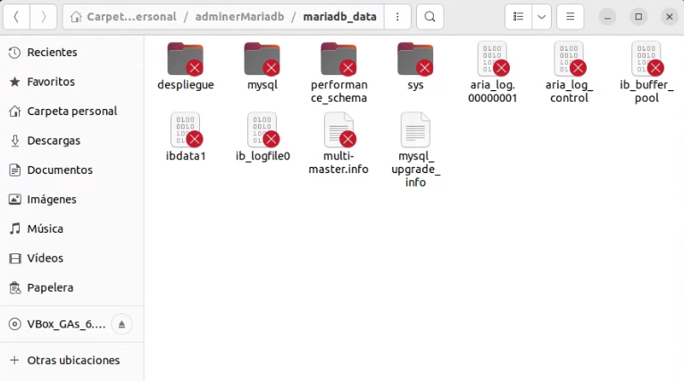

---

title: Tarea Evaluable 3 - Segundo Cuatrimestre
author: David García Vincelle
creator: Typora inc.
subject: Despliegue de Aplicaciones Web
footer: David García Vincelle - Actividad Evaluable 3 EV2 Ejercicio 2


---


<h1 style='padding-left: 5%;padding-right: 5%;letter-spacing: 5px;font-size: 200%;'>
TAREA EVALUABLE<br>SEGUNDO CUATRIMESTRE
<h4 style='text-align: right;padding-right: 7.2%'> DESPLIEGUE DE APLICACIONES WEB</h4>
</h1>
<h3 style='text-align: right;padding-right: 7.2%'> David García Vincelle</h3>

# Solución Ejercicio 2
## 1.1 Despliegue de contenedor en red: Adminer y MariaDB

> #### En ese ejercicio, voy a crear los contenedores via docker-compose
>
> En cada apartado donde haya que crear un contenedor, indicaré la parte de código que debemos añadir al fichero docker-compose.yml, para finalmente, lanzar el script que cree todos los contenedores y deje los microservicio funcionando como se solicita

#### 1.1.1 Crea una red `bdnet`

- Creamos una red de tipo `bridge` que se llame `bdnet`

  ```dockerfile
  docker network create bdnet
  ```

#### 1.1.2 Crea un contenedor con una imagen de `mariaDB` que estará en la red `bdnet` . Este contenedor se ejecutará en segundo plano, y será accesible a través del puerto 3306. (Es necesario definir la <u>contraseña del usuario `root`</u> y un <u>volumen de datos persistente</u> [con cualquier método] )

- Creamos un directorio llamado `adminerMariadb`, donde entraremos y  crearemos el fichero `docker-compose.yml` 
  
   > En mi caso me encuentro en: `/home/cliente-david`
   
   ```bash
   mkdir adminerMariadb
   cd adminerMariadb
  gedit docker-compose.yml
  ```
  
- Una vez cargado el editor de textos de ubuntu, implementamos el siguiente código:

  > el volumen de datos persistente, lo creamos colgando del propio directorio `adminerMariadb`, creando un subdirectorio `mariadb_data`

  ```dockerfile
  version: '3.1'
  services:
  mariadb:
    container_name: mariadb
    image: mariadb 
    restart: always
    environment:
      MYSQL_ROOT_PASSWORD: root
    volumes:
      - ./mariadb_data:/var/lib/mysql    
  networks:
  default:
    external:
      name: bdnet
  ```

- Una vez guardado, NO procedemos aún a lanzar el script de `docker-compose`, pues queremos completarlo en el apartado siguiente

#### 1.1.3 Crea un contenedor con el programa `Adminer` que se pueda conectar al contenedor de la BD

- Completamos la configuración del fichero  `docker-compose.yml` añadiendo el código necesario para que `docker-compose` implemente la creación del contenedor `adminer`

  
  ```dockerfile
  adminer:
    container_name: adminer
    image: adminer
    restart: always
    environment:
      ADMINER_DEFAULT_SERVER: mariadb
    ports:
      - 8080:8080
    depends_on:
      - mariadb 
  ```
- lo realizamos de forma que el contenido final del código sea el siguiente:  
  
  ```dockerfile
  version: '3.1'
  services:
  mariadb:
    container_name: mariadb
    image: mariadb 
    restart: always
    environment:
      MYSQL_ROOT_PASSWORD: root
    volumes:
      - ./mariadb_data:/var/lib/mysql   
  adminer:
    container_name: adminer
    image: adminer
    restart: always
    environment:
      ADMINER_DEFAULT_SERVER: mariadb
    ports:
      - 8080:8080
    depends_on:
      - mariadb 
  networks:
  default:
    external:
      name: bdnet
  ```

> Nos aseguramos de que el contenedor `adminer` no se cree antes de que el contenedor `mariadb` ya esté creado, y por tanto pueda conectarse al servidor de bases de datos, implementando su dependencia en el script.

- Una vez guardado, procedemos a lanzar el script de `docker-compose` y **comprobamos que los contenedores estan creados y en ejecución**

  ```bash
  docker-compose up -d
  docker ps -a
  ```

  

- Comprobamos que estan el la red correcta
  ```bash
  docker network inspect bdnet
  ```
  


#### 1.1.4 Utiliza Adminer para conectar con el contenedor del servidor de la base de datos abriendo un navegador web y accediendo a la URL: http://localhost:8080

> Abrimos el navegador web Firefox y escribimos la dirección de nuestro servicio web con adminer:`localhost:8080`


#### 1.1.5 Crea una base de datos llamada *despliegue*

- Hacemos login con los datos de usuario `root` y contraseña `root`

- Creamos la base de datos `despliegue` haciendo click en crear base de datos
  
  


-  Guardamos la base de datos
  


- Vemos cómo ha sido creada
  


- Borramos los contenedores, la red y los volumenes utilizados

    ```bash
  docker-compose down
  docker system prune
  docker volume prune
  ```
  


> No se libera espacio al eliminar el volumen `mariadb_data` por que hemos utilizado un bind mount

- Comprobamos que los datos generados por el contenedor del servidor de base de datos, persisten
   
