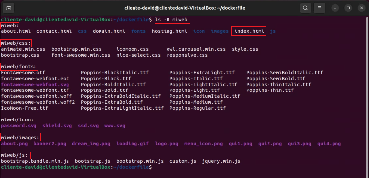
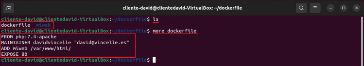
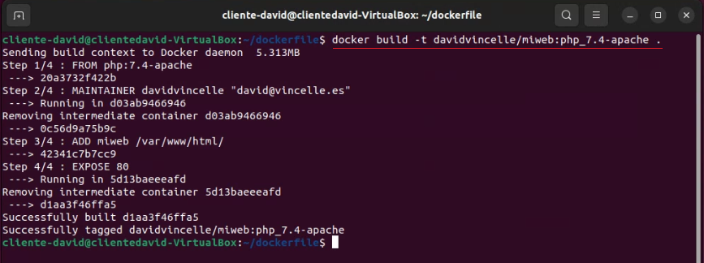
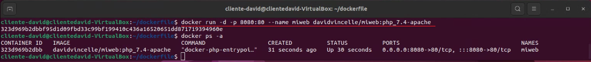
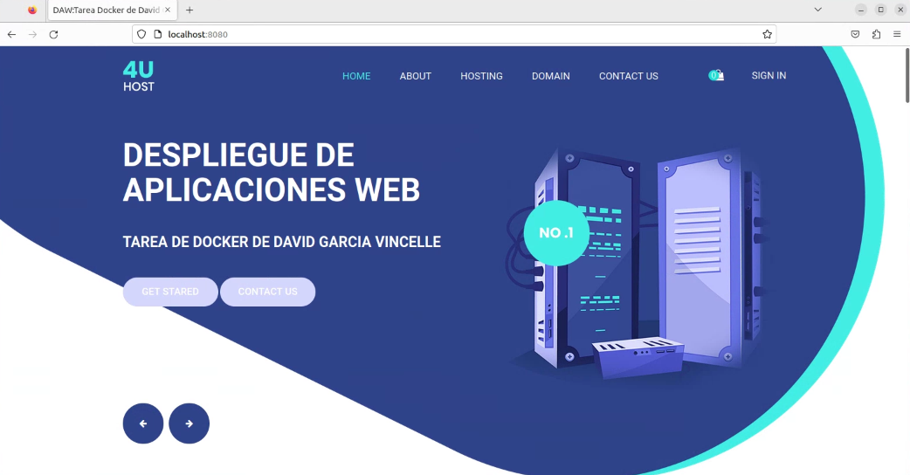
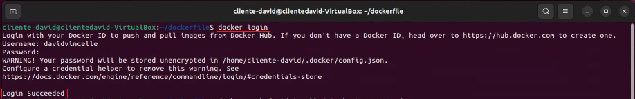
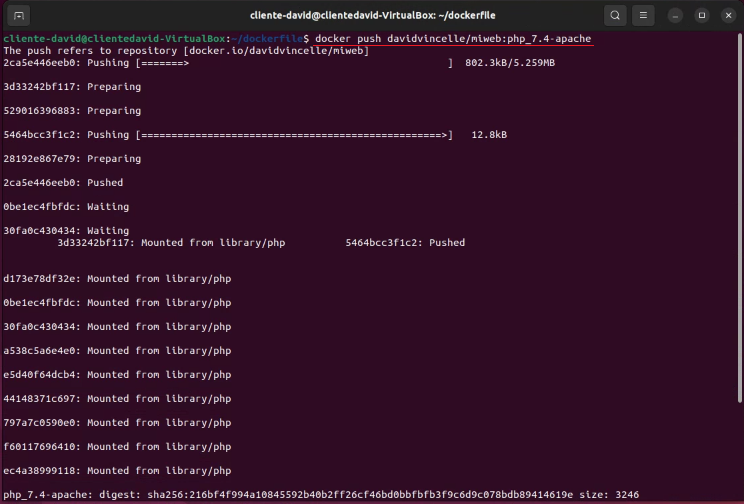
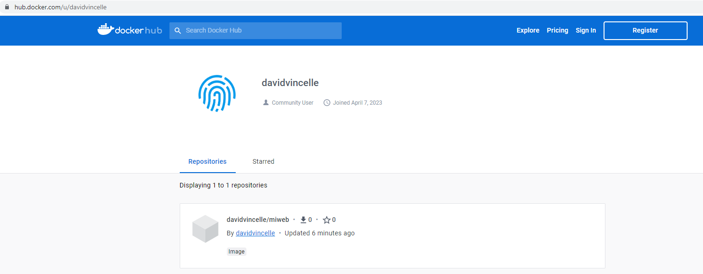

---

title: Tarea Evaluable 3 - Segundo Cuatrimestre
author: David García Vincelle
creator: Typora inc.
subject: Despliegue de Aplicaciones Web
footer: David García Vincelle - Actividad Evaluable 3 EV2 Ejercicio 3


---

<h1 style='padding-left: 5%;padding-right: 5%;letter-spacing: 5px;font-size: 200%;'>
TAREA EVALUABLE<br>SEGUNDO CUATRIMESTRE
<h4 style='text-align: right;padding-right: 7.2%'> DESPLIEGUE DE APLICACIONES WEB</h4></h1>
<h3 style='text-align: right;padding-right: 7.2%'> David García Vincelle</h3> 


# Solución Ejercicio 3
## Imagen con Dockerfile

## 1 Crear una imagen con un servidor web que sirva un sitio web

#### 1.1 Basar la imagen en `nginx` o `apache` o `php:7.4-apache`

- Utilizaré como base la imagen docker `php:7.4-apache`

#### 1.2  Despliega una plantilla, o un proyecto tuyo, que tenga, al menos, un `index.html` y una carpeta para estilos, imágenes, etc. - Puedes reutilizar la plantilla del ejercicio 1

> Voy a trabajar dentro de un directorio llamado `dockerfile`
> Reutilizo la plantilla del ejercicio 1 y la coloco dentro del directorio `dockerfile/miweb`

- Muestro un listado recursivo del directorio `miweb`

  ```
  ls -R miweb
  ```

  

- Creo el fichero `dockerfile` con el editor de textos de ubuntu

  ```
  gedit dockerfile 
  ```

- implemento el código que posteriormente me servirá para crear la imagen docker, y guardo los cambios

  ```
  FROM php:7.4-apache
  MAINTAINER davidvincelle "david@vincelle.es"
  ADD miweb /var/www/html/
  EXPOSE 80
  ```

- Muestro la carpeta con los ficheros del sitio web, el dockerfile y el bloque de código

  ```bash
  ls
  more dockerfile
  ```
  
  
- Creo la imagen con el comando `docker build`

  > La imagen se llamará `miweb:php_7.4-apache`
  
  ```
  docker build -t davidvincelle/miweb:php_7.4-apache .
  ```
  

#### 1.1.2 Crea un contenedor basado en dicha imagen y accede al sitio web desde un navegador

- Creamos el contenedor para que sea accesible por el puerto 8080 y mostramos que está en funcionamiento

  ```
  docker run -d -p 8080:80 --name miweb davidvincelle/miweb:php_7.4-apache
  docker ps -a
  ```
  
  
- Ahora **comprobamos que el sitio web está operativo** 

  > Abrimos el navegador web Firefox y escribimos la dirección de nuestro servicio web:`localhost:8080`




#### 1.1.3 Sube la imagen a tu cuenta DockerHub

- Me autentifico en Docker Hub usando el comando `docker login`

  ```dockerfile
  docker login
  ```
  

- Distribuyo mi imagen mediante `docker push`

  ```dockerfile
  docker push davidvincelle/miweb:php_7.4-apache
  ```
  

- Compruebo que la imagen ya esta subida a mi cuenta de Docker Hub
 
